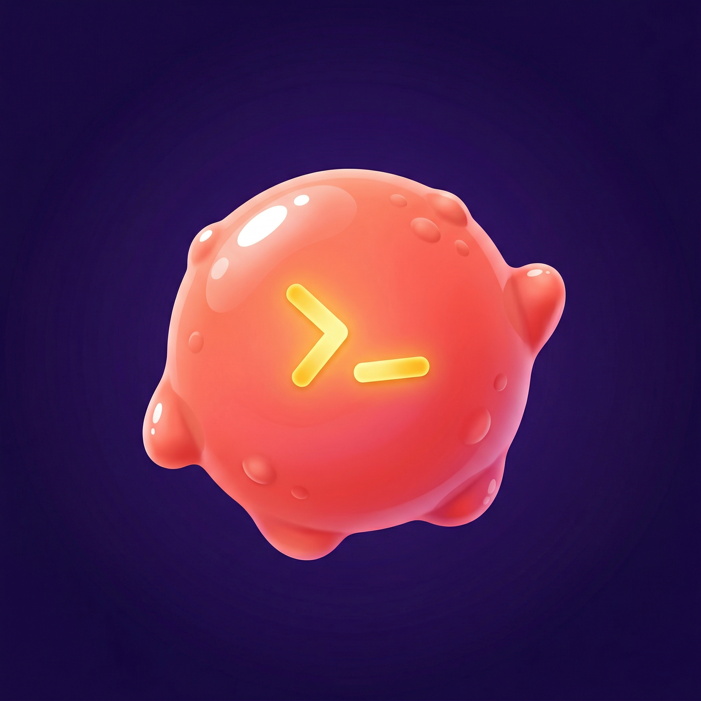

# 🎮 zsh-play

<p align="center">
  
</p>

**Antigravity Playgrounds without the Agent Manager.**

Antigravity's [Agent Manager](https://antigravity.google/product) includes a **Playground**, a scratch workspace for exploring ideas with AI agents without setting up a full project. But the Agent Manager is resource-heavy.

`zsh-play` gives you the same workflow: disposable, named workspaces you can spin up and tear down, entirely from your terminal. It also surfaces your **Antigravity workspaces** — every project you've opened in Antigravity — so you can jump back into any of them with a single command.

## The Problem

The Agent Manager routinely eats **15–20 GB RAM**, leaks memory in language servers, and crashes during casual use. You shouldn't need a full IDE session just to explore a new topic. And opening your editor in a random directory leaves orphaned folders everywhere.

**`play` solves both problems:**

```sh
play my-topic
# creates ~/agy-playgrounds/my-topic/ and opens it in the Antigravity editor
```

That's it. One command. A clean, dedicated directory opens in the Antigravity editor. When you're done, clean up is just as easy.

> [!NOTE]
> Antigravity stores playground data in `~/.gemini/antigravity/brain/<UUID>/`, which is opaque and unmanageable from the terminal. `zsh-play` uses `~/agy-playgrounds` instead - flat, human-readable names you can browse and clean up.

## Usage

**1. Create a playground**

```sh
play my-topic
# 🎮 Playground: ~/agy-playgrounds/my-topic
```

A new directory is created and opened in the Antigravity editor. Need a throwaway? Skip the name:

```sh
play
# 🎮 Playground: ~/agy-playgrounds/20260325-143052
```

**2. Open an existing workspace**

If the name matches a project you've previously opened in Antigravity, it opens that project directly — no new playground created:

```sh
play my-api
# 🚀 Workspace: /Users/you/dev/my-api
```

**3. See what you've got**

```sh
play ls
# 📂 Playgrounds (3 total, 16.7 MB)
#
#   my-topic      12.4 MB  2 days ago
#   quick-test       1.2 MB  5 days ago
#   20260320-153832  3.1 MB  1 week ago
#
# 🚀 Antigravity Workspaces (5 total)
#
#   my-api           ~/dev/my-api                          10h ago
#   blog             ~/dev/blog                            1 day ago
#   client-site      ~/dev/freelance/client-site            3 days ago
#   zsh-play         ~/dev/open-source/zsh-play             5 days ago
#   dotfiles         ~/dev/dotfiles                         3 months ago
```

The workspaces section shows every project you've opened in Antigravity, sorted by most recently used. Internal directories (`.gemini`, `.ssh`, etc.) are filtered out automatically.

**4. Clean up**

```sh
play rm my-topic
# 🗑  Trash playground 'my-topic' (12.4 MB)? [y/N] y
# ✅ Trashed 'my-topic' (12.4 MB) - recoverable from Trash
```

Don't remember the name? Just run `play rm` for an interactive picker:

```sh
play rm
# 📋 Playgrounds:
#   1) my-topic      12.4 MB  2 days ago
#   2) quick-test       1.2 MB  5 days ago
#   3) 20260320-153832  3.1 MB  1 week ago
#
# Pick one to trash (or q to quit):
```

> [!NOTE]
> `play rm` only removes **playgrounds**. Your Antigravity workspaces (real project directories) are never modified or deleted.

## Install

### [Oh My Zsh](https://ohmyz.sh/)

```zsh
git clone https://github.com/chongivan/zsh-play ${ZSH_CUSTOM:-~/.oh-my-zsh/custom}/plugins/play
```

Add `play` to your plugins in `~/.zshrc`:

```zsh
plugins=(... play)
```

### [Zinit](https://github.com/zdharma-continuum/zinit)

```zsh
zinit light chongivan/zsh-play
```

### [Antidote](https://antidote.sh/)

Add to `.zsh_plugins.txt`:

```
chongivan/zsh-play
```

### Manual

```zsh
git clone https://github.com/chongivan/zsh-play ~/.zsh-play
echo 'source ~/.zsh-play/play.plugin.zsh' >> ~/.zshrc
```

## Configuration

Defaults work out of the box. To customize, add any of these to your `~/.zshrc` **before** the line that loads the plugin:

```zsh
# where playgrounds are stored
export PLAY_DIR="$HOME/my-playgrounds"       # default: ~/agy-playgrounds

# editor to open playgrounds with
export PLAY_OPEN_CMD="cursor"                # default: agy --new-window
export PLAY_OPEN_CMD="code"                  # VS Code
export PLAY_OPEN_CMD="zed"                   # Zed
export PLAY_OPEN_CMD="agy"                   # Antigravity (reuse window)

# Antigravity workspace storage path (auto-detected for macOS)
export PLAY_AG_WS_STORAGE="$HOME/Library/Application Support/Antigravity/User/workspaceStorage"

# extra directories to exclude from workspace listing (pipe-separated)
export PLAY_AG_EXCLUDE="$HOME/scratch|$HOME/tmp"
```

## All Commands

| Command | Description |
|---|---|
| `play [name]` | Create & open a playground, or open a matching workspace |
| `play ls` | List playgrounds and Antigravity workspaces |
| `play rm [name]` | Trash a playground (interactive picker if no name) |
| `play rm --all` | Trash all playgrounds |
| `play rm --purge <name>` | Permanently delete, no recovery |
| `play rm -f <name>` | Skip confirmation prompt |
| `play help` | Show help |

### How `play [name]` resolves

1. **Existing playground?** → opens it
2. **Antigravity workspace match?** → opens the project directory
3. **Neither?** → creates a new playground

## How Deletion Works

By default, `play rm` moves playgrounds to macOS Trash. Fully recoverable via Finder.

Use `--purge` for permanent deletion (`rm -rf`). **This is irreversible.**

Combine flags as needed: `play rm --purge -f old-project`

> [!IMPORTANT]
> `play rm` only affects playgrounds in `$PLAY_DIR`. Workspaces are read-only — they are listed but never modified or deleted by this plugin.

## Tab Completion

`play` includes smart completions out of the box:

- **Subcommands**: `play <TAB>` → `ls`, `rm`, `help`, playground names, and workspace names
- **rm flags**: `play rm <TAB>` → `--all`, `--purge`, `-f`, `--force`, and playground names
- **Playground names**: available anywhere a name is expected
- **Workspace names**: available when selecting a target to open

## Requirements

- **zsh** (macOS default shell)
- **macOS** (uses `/usr/bin/trash` for safe deletion)
- **python3** (optional, required for Antigravity workspace listing)

## License

[MIT](LICENSE)
